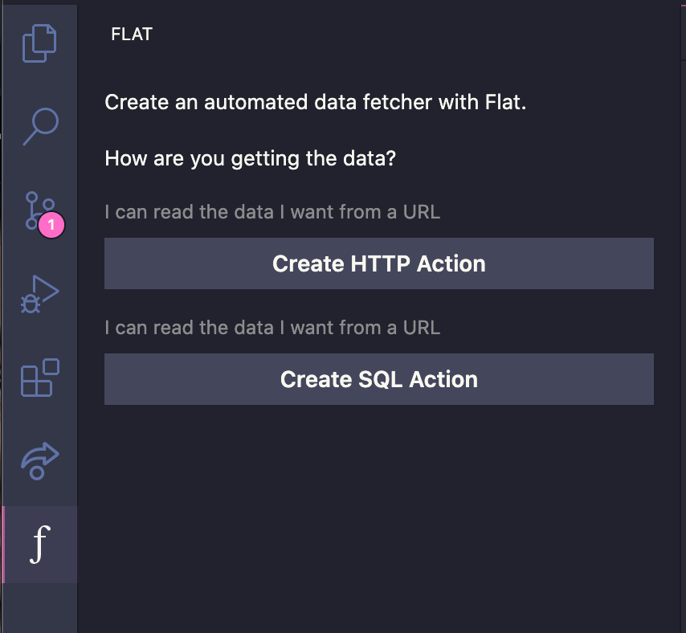

<p align="center">
  
</p>

# Flat

Flat is a VSCode extension that steps you through the process of creating a [Flat action](https://github.com/githubocto/flat), which makes it easy to fetch data and commit it to your repository as flatfiles.

Just as [materialized views](https://en.wikipedia.org/wiki/Materialized_view) make it easier and faster to work the results of a query, Flat makes it easy to materialize data from anywhere into your workspace.

Flat streamlines a pattern popularized by [Simon Willison](https://simonwillison.net/2020/Oct/9/git-scraping/) and [Alex Gaynor](https://github.com/alex/nyt-2020-election-scraper)). The pattern of pulling data into git is an interesting one that deserves a dead-simple developer experience. Flat is an experiment from GitHub's Office of the CTO to make it easier for anyone to employ this pattern.

## Usage

### VS Code & Codespaces

To use Flat, install the extension and click the Flat icon in the sidebar [Tree View Container](https://code.visualstudio.com/api/extension-capabilities/extending-workbench).

You will prompted to authenticate with GitHub (nb: Flat uses the `user:email` and `repo` scopes).

Once authenticated, Flat will either guide you through the steps for creating a Flat action, or list all workflow runs of said action.

<p></p>

### Creating an HTTP action

To create an HTTP action, you'll be asked for the following inputs:

1. A URL
2. A CRON schedule
3. A name

These inputs will be used to generate and commit a `.github/workflows/flat.yaml` file to your repository.

### Creating a SQL action

To create a SQL action, you'll be asked for the following inputs:

1. A database connection string <span style="color: red;">\*</span>
2. A CRON schedule
3. A format for saving your data (CSV or JSON)
4. A name

<span style="color: red;">\*</span> Note that we will encrypt this value and create a [GitHub secret](https://docs.github.com/en/actions/reference/encrypted-secrets) in your repository for this connection string. No sensitive data will be committed to your repository.

These inputs will be used to generate and commit a `.github/workflows/flat.yaml` file to your repository.

### Viewing Workflow Runs

If Flat determines that you already have an action with runs, it will instead list these runs.

## Appendix

### Action Inputs

The action currently has two fetching modes:

- `http`: GETs a supplied URL
- `sql`: Queries a SQL datastore

These two modes are exclusive; you cannot mix settings for these two in one Flat step for a workflow job.

### `outfile_basename`

This value is used as the basis for the file created to store data fetched by Flat. An extension is appended to this value at runtime to determine the actual filename. The behavior depends on Flat's fetching mode:

- `http`
  1. If the response headers contain a `content-disposition` header, determine an extension from that.
  2. Otherwise, attempt to infer an extension based on a `content-type` header, if available.
  3. Give up and use `outfile_basename` as the entire filename, without an extension.
- `sql`: the extension is determined on the basis of the `sql_format` input.

### `http_url`

A URL from which to fetch data. Specifying this input puts Flat into `http` mode.

### `sql_connstring`

A URI-style database connection string. Flat will use this connection string to connect to the database and issue the query.

> ⚠️ Don't write secrets into your workflow.yml!
>
> Most connection strings contain an authentication secret like a username and password. GitHub provides an encrypted vault for secrets like these which can be used by the action when it runs. [Create a secret](https://docs.github.com/en/actions/reference/encrypted-secrets#creating-encrypted-secrets-for-a-repository) on the repository where the Flat action will run, and use that secret in your workflow.yaml like so:
>
> ```
> sql_connstring: ${{NAME_OF_THE_CREATED_SECRET}}
> ```
>
> If you're using the [flat-vscode extension](https://github.com/githubocto/flat-vscode), this is handled for you.

### `sql_format`

One of `csv` or `json`. SQL query results will be serialized to disk in the specified format. Defaults to `json`.

> ⚠️ While the JSON is not pretty-printed, CSV is often a more efficient serialization for tabular data.

### `sql_queryfile`

The name of the file containing the SQL query that will be issued to the database. Defaults to `query.sql`, which must be placed in `.github/workflows` alongside the `workflow.yml`.

## Outputs

### `delta_bytes`

A signed number describing the number of bytes that changed in this run. If the new data is smaller than the existing, committed data, this will be a negative number.
